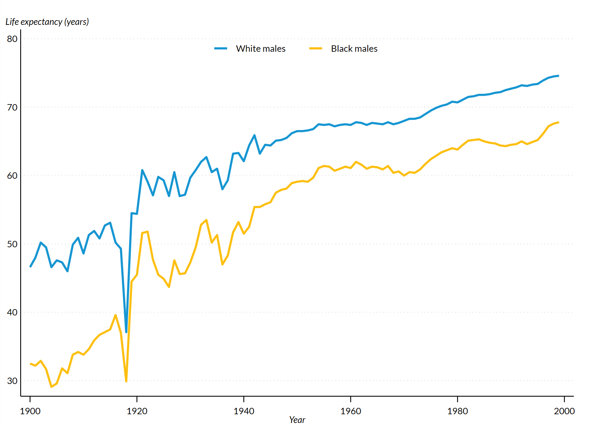

# urbanscheme

## Overview
`urbanscheme` is a custom Stata scheme for creating Urban Institute-themed plots (see `help schemes` for more [details](https://www.stata.com/manuals/g-4schemesintro.pdf)). The scheme is built upon the popular `s2color` scheme, with further customizations to align with the [Urban Institute Data Visualization Style Guide](https://urbaninstitute.github.io/graphics-styleguide/).

Currently, this scheme is optimized to produce report-ready static figures *without* titles, subtitles, citations, or notes. These must be included separately in your report.

## Setup

## Fonts
The Urban Institute uses [Lato](https://fonts.google.com/specimen/Lato) font for publications. Make sure [Lato](https://fonts.google.com/specimen/Lato) is installed before proceeding. The Lato font cannot be included in the scheme and must be set independently (see Usage).

## Usage

### Getting Started
First, set the scheme and font at the beginning of a .do file with the following commands:
```
set scheme urbanscheme
graph set window fontface "Lato"
```
Instead of globally setting the scheme, you may alternatively include `scheme(urbanscheme)` within a plot code chunk.

### Italics
The Urban Style Guide indicates that axes titles should be in italicized Lato font. While Lato is called using `graph set window fontface "Lato"`, italics must be indicated independently within plot code chunks using Stata Markup Control Language ([SMCL](https://www.stata.com/manuals/g-4text.pdf#g-4text))

For example:
```
xtitle("{it:This is my x-axis title}")
```

### Exporting Plots
Sample plots in this repo are included as `.png` files. If using Windows, export plots as `.emf` files for best quality. 
After generating a plot, include the following line:
```
graph export "[PATH]\[PLOT NAME].[FILE TYPE]", replace
```
Where `[FILE TYPE]` may be `emf`, `png`, etc.

### Example: line plot
```
webuse uslifeexp, clear
placeholder for code
```


## Contact
Contact Jen Andre for feedback or questions.
