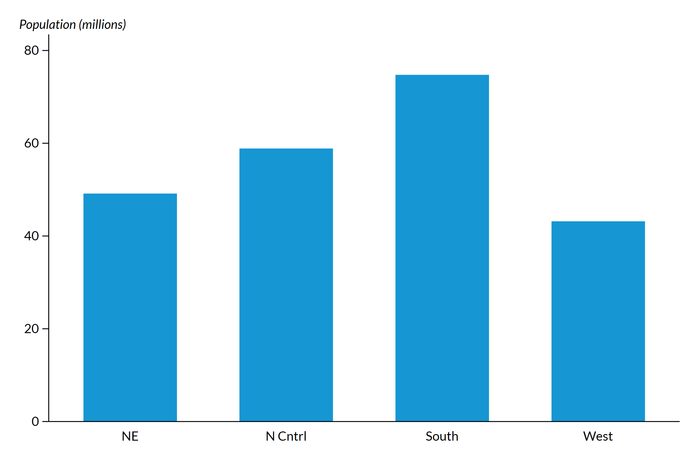
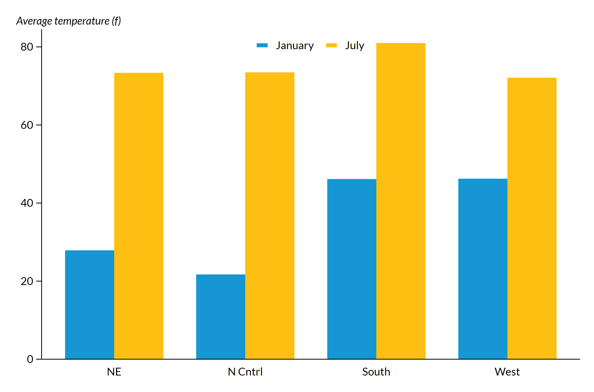
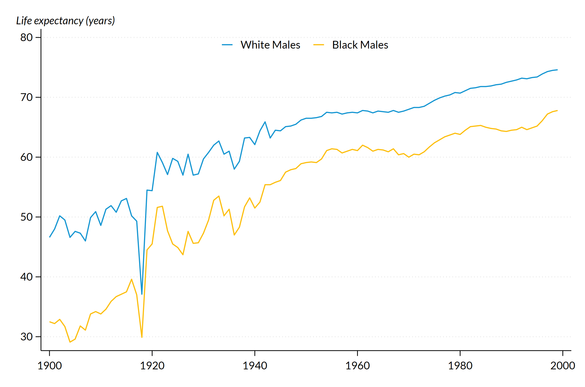
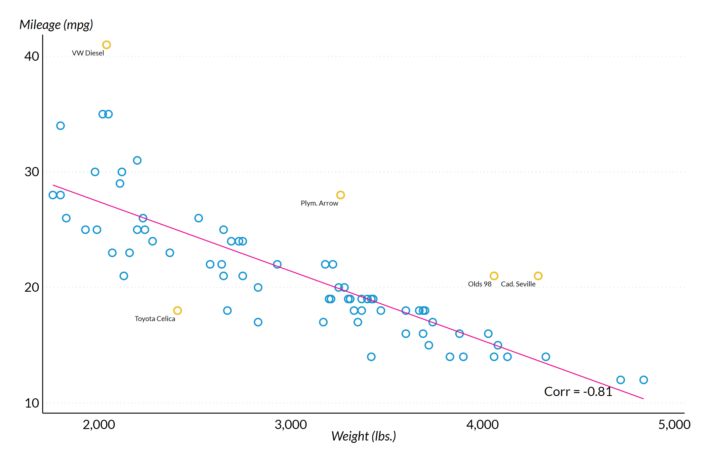

# urbanplots

## Overview
`urbanplots` is a custom Stata scheme for creating Urban Institute-themed plots (see `help schemes` for more [details](https://www.stata.com/manuals/g-4schemesintro.pdf)). The scheme is built upon the popular `s2color` scheme, with further customizations to align with the [Urban Institute Data Visualization Style Guide](https://urbaninstitute.github.io/graphics-styleguide/).

Currently, this scheme is optimized to produce report-ready static figures *without* titles, subtitles, citations, or notes. These must be included separately in your report.

This scheme is currently under development.

## Background
Stata offers a lot of flexibility for data visualizations. This flexibility is great for developing complex, reproducibile visualizations - but, it requires long and confusing syntax. The goal of this scheme is to include most of that complex syntax as default settings, so that the user can focus on the most important plotting decisions while complying with the Urban Style Guide.

Here are some helpful resources:
* [Stata graphs: Define your own color schemes, by Asjad Naqvi on Medium](https://medium.com/the-stata-guide/stata-graphs-define-your-own-color-schemes-4320b16f7ef7)
* [Scheming your way to your favorite graph style, by Kristin MacDonald on The Stata Blog](https://blog.stata.com/2018/10/02/scheming-your-way-to-your-favorite-graph-style/)
* [Intro to schemes, Stata documentation](https://www.stata.com/manuals/g-4schemesintro.pdf)

## Setup

### Install
By default, these instructions will install the scheme files into your "PLUS" ado directory (see [ado details](https://www.stata.com/support/faqs/programming/personal-ado-directory/), see [net details](https://www.stata.com/manuals13/rnet.pdf)). Use command `sysdir` to confirm this location.
```
net install urbanplots, from(TBD)
```

### Fonts
The Urban Institute uses Lato font for publications. Make sure [Lato](https://fonts.google.com/specimen/Lato) is installed before proceeding. The Lato font cannot be included in the scheme and must be set independently (see Tips).

## Getting Started
First, set the scheme and font at the beginning of a .do file with the following commands:
```
set scheme urbanplots
graph set window fontface "Lato"
```
Instead of globally setting the scheme, you may alternatively include `scheme(urbanscheme)` within a plot code chunk.

These commands can be included in your `profile.do` to automatically run on startup (see [details](https://www.stata.com/support/faqs/programming/profile-do-file/)).

## Tips
### Italic Font
The Urban Style Guide indicates that axes titles should be in italicized Lato font. While Lato is called using `graph set window fontface "Lato"`, italics must be indicated independently within plot code chunks using Stata Markup Control Language ([SMCL](https://www.stata.com/manuals/g-4text.pdf#g-4text)).

For example:
```
xtitle("{it:This is my x-axis title}")
```

### y-axis Titles
The Urban Style Guide indicates that the y-axis title should be horizontal aross the top left corner of the plot. This change is not automatically reflected in the scheme. Add the following lines to your plot code to make this change:
```
  subtitle("{it:This is my y-axis title") ///
  ytitle("")
```

### Grid lines
Grid lines are on by default. To turn these off, add the following line to your plot code:
```
ylab(, glcolor(white))
```

### Ticks
Axis ticks are on by default for many plots. To remove these ticks, add the following line to your plot code:
```
ylab(, noticks)
xlab(, noticks)
```

### Exporting Plots
Sample plots in this repo are included as `.png` files. If using Windows, I recommended exporting plots as `.emf` files for best quality. 
After generating a plot, include the following line:
```
graph export "[PATH]\[PLOT NAME].[FILE TYPE]", replace
```
Where `[FILE TYPE]` may be `emf`, `png`, etc.

## Examples
### Bar/Column Plot
This bar plot compares population (in millions) by US region. We make the necessary y-axis placement adjustment (described above) with the `subtitle` and `ytitle` lines. We also remove the grid lines (described above) with the `ylab` line.
```
sysuse census, clear
collapse (sum) pop, by(region)
gen pop_mil = pop / 1000000

graph bar pop_mil, ///
	over(region) ///
	subtitle("{it:Population (millions)}") ///
	ytitle("") ///
	ylab(, glcolor(white))
```


### Grouped Bar/Column Plot
This bar plot compares average January and July temperature by US region. We make the necessary y-axis placement adjustment (described above) with the `subtitle` line (the `ytitle` is not necessary here due to the default settings for a grouped bar chart). We also edit the legend labels with the `legend` line.
```
sysuse citytemp, clear

graph bar tempjan tempjuly, over(region) ///
	subtitle("{it:Average temperature (f)}") ///
	ylab(, glcolor(white)) ///
	legend(label(1 "January") label(2 "July"))	
```


### Line Plot
This line plot compares average US life expectancy over time for white males and Black males. We make the necessary y-axis placement adjustment (described above) with the `subtitle` line (the `ytitle` line is not necessary here due to the default settings for a line chart with two series). We also choose to remove the automatic x-axis label ("Year") because the x-axis is understandable without it.  We also edit the legend labels with the `legend` line.
```
sysuse uslifeexp, clear

line le_wm le_bm year, ///
	subtitle("{it:Life expectancy (years)}") ///
	xtitle("") ///
	legend(label(1 "White Males") label(2 "Black Males"))
```


### Scatter Plot with Best Fit Line
This scatter plot with best fit line explores the relationship between automobile weight and mileage. This example is intended to demonstrate a more complex `twoway` plot and provides examples of customizing some `urbanplots` defaults. 

A `twoway` plot allows us to overlay multiple plots. The first `scatter` plots all points, and we choose to customize the `msymbol` and `msize`. The second `scatter` plots the points for which we have created a `label_indicator`, and we add a range of customizations for the labels. Then, the `lfit` line plots a predicted line of best fit, and we specify the color and width of this line.

Additional customizations include:
* turn off the legend with the `legend` line
* y-axis placement adjustment (described above) with the `subtitle` line
* make x-axis label italicized with the `xtitle` line
* remove ticks with the `xlab` and `ylab` lines
* add text with the stored correlation coefficient with the `text` line
```
sysuse auto, clear

gen label_indicator = inlist(make, "VW Diesel", "Plym. Arrow", "Olds 98", "Cad. Seville", "Toyota Celica") // outliers to label

corr mpg weight // store correlation coefficient
local rho = string(r(rho), "%03.2f")
di("`rho'")

twoway /// 
	(scatter mpg weight, msymbol(circle_hollow) msize(1.5)) || ///
	(scatter mpg weight if label_indicator == 1, ///
		msymbol(circle_hollow) msize(1.5) ///
		mlabel(make) mlabposition(7) mlabgap(.2) mlabsize(1.5) mlabcolor("0 0 0")) || ///
	(lfit mpg weight, lcolor("236 0 139") lwidth(.2)), ///
	legend(off) ///
	subtitle("{it:Mileage (mpg)}") ///
	xtitle("{it:Weight (lbs.)}") ///
	xlab(, noticks) ///	
	ylab(, noticks) ///
	text(11 4500 `"Corr = `rho'"')
```


## Contact
Contact Jennifer Andre (jandre@urban.org) for feedback or questions.
