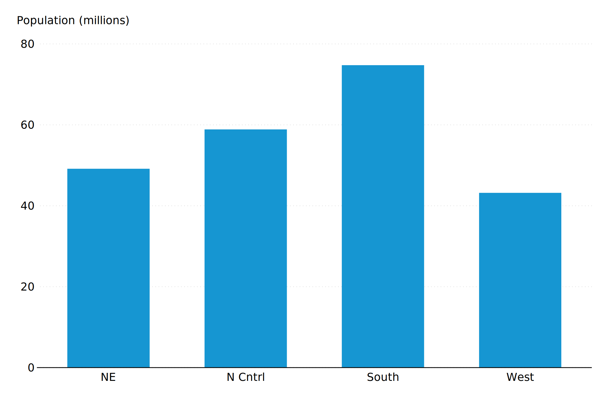
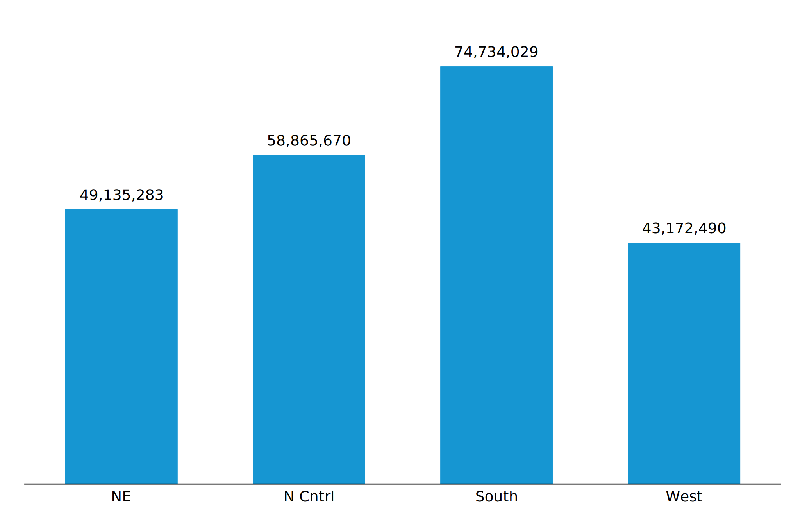
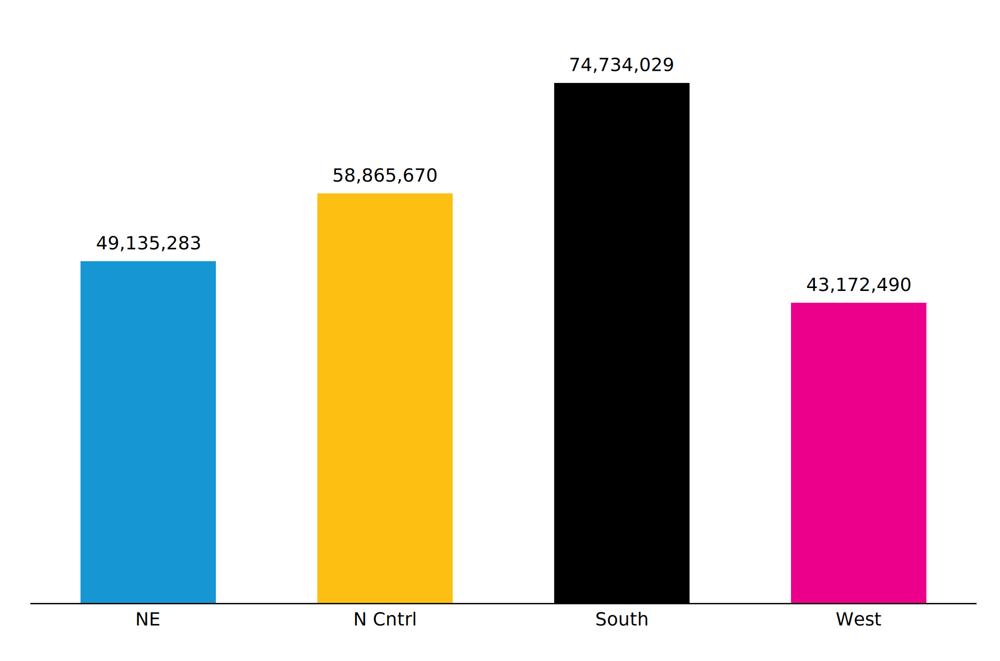
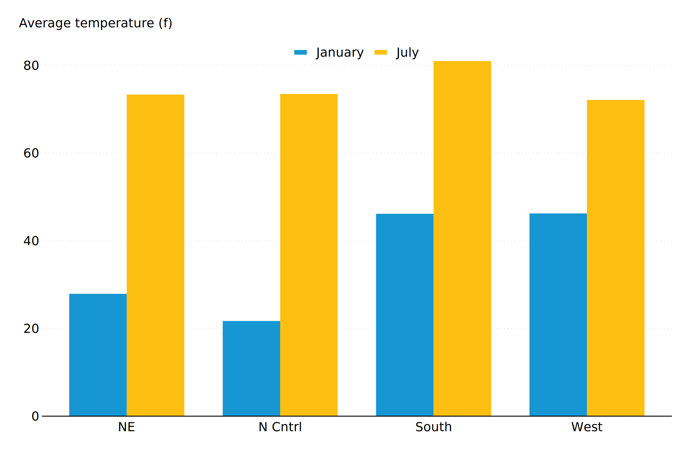
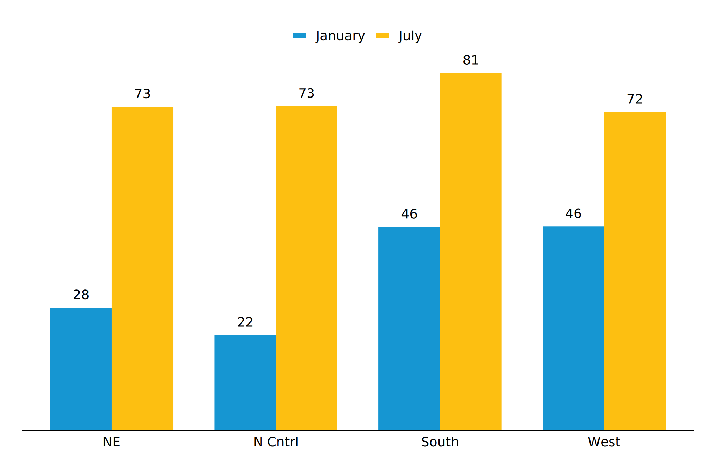
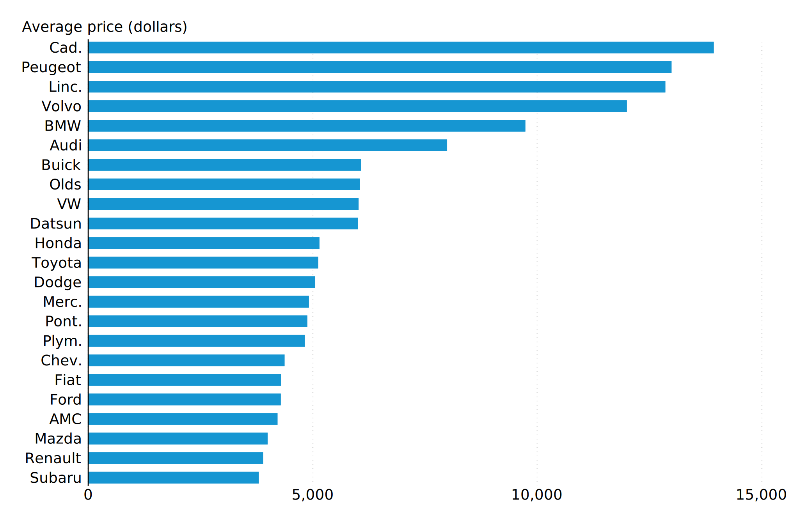
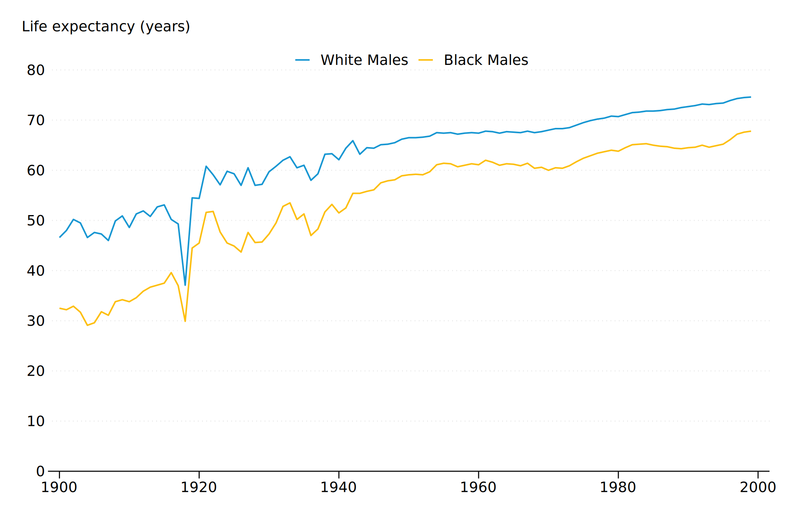
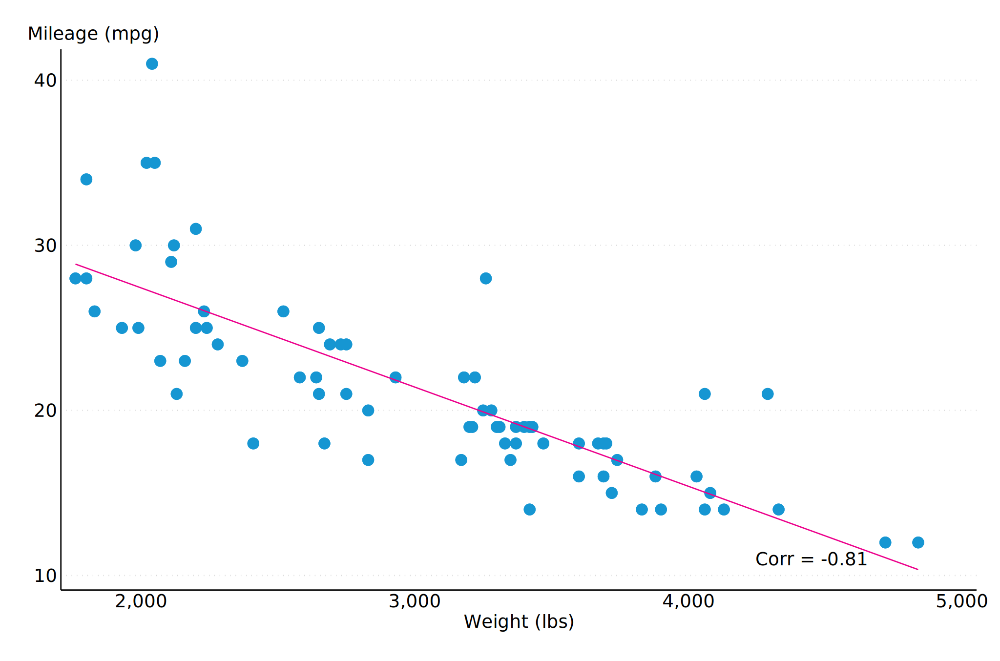

# urbanplots

## Overview
`urbanplots` is a custom Stata scheme for creating Urban Institute-themed plots (see `help schemes` for more [details](https://www.stata.com/manuals/g-4schemesintro.pdf)). The scheme is built upon the popular `s2color` scheme, with further customizations to align with the [Urban Institute Data Visualization Style Guide](https://urbaninstitute.github.io/graphics-styleguide/).

Currently, this scheme is optimized to produce report-ready static figures *without* titles, subtitles, citations, or notes. These must be included separately in your report.

This scheme is currently under development.

## Background
Stata offers a lot of flexibility for data visualizations. This flexibility is great for developing complex, reproducibile visualizations - but, it often requires long and potentially confusing syntax. The goal of this scheme is to include most of that complex syntax as default settings, so that the user can focus on the most important plotting decisions while complying with the Urban Institute Data Visualization Style Guide.

This scheme is not intended to cover the vast range of graphing capabilities and options. Refer to Stata documentation to learn more about [graph commands](https://www.stata.com/manuals13/g-2graph.pdf).

Here are some helpful resources on schemes:
* [Stata graphs: Define your own color schemes, by Asjad Naqvi on Medium](https://medium.com/the-stata-guide/stata-graphs-define-your-own-color-schemes-4320b16f7ef7)
* [Scheming your way to your favorite graph style, by Kristin MacDonald on The Stata Blog](https://blog.stata.com/2018/10/02/scheming-your-way-to-your-favorite-graph-style/)
* [Intro to schemes, Stata documentation](https://www.stata.com/manuals/g-4schemesintro.pdf)

## Setup

### Install
By default, these instructions will install the scheme files into your "PLUS" ado directory (see [ado details](https://www.stata.com/support/faqs/programming/personal-ado-directory/), see [net details](https://www.stata.com/manuals13/rnet.pdf)). Use command `sysdir` to confirm this location.
```
net install urbanplots, from(TBD)
```

### Fonts
The Urban Institute uses Lato font for publications. Make sure [Lato](https://fonts.google.com/specimen/Lato) is installed before proceeding. The Lato font cannot be included in the scheme and must be set independently (see Tips).

## Getting Started
Set the scheme and font at the beginning of a .do file with the following commands:
```
set scheme urbanplots
graph set window fontface "Lato"
```
Instead of globally setting the scheme, you may alternatively include `scheme(urbanscheme)` within a plot code chunk.

These commands can be included in your `profile.do` to automatically run on startup (see [details](https://www.stata.com/support/faqs/programming/profile-do-file/)).

## Tips
This section covers a range of guidelines for certain aspects of the scheme. These tips generally suggest adding a specific line to your plotting code. Note that you can only have one instance of each option - for example, if your plotting code already includes a `ylab` option, you cannot add another separate one. Instead, you must combine the suboptions within one option. For example:
```
ylab(, suboption1 suboption2)
```

### Italic Font
The Urban Institute Data Visualization Style Guide indicates that axes titles should be in italicized Lato font. While Lato is called using `graph set window fontface "Lato"`, italics must be indicated independently within plot code chunks using Stata Markup Control Language ([SMCL](https://www.stata.com/manuals/g-4text.pdf#g-4text)).

For example:
```
xtitle("{it:This is my x-axis title}")
```

### y-axis Titles
The Urban Institute Data Visualization Style Guide indicates that the y-axis title should be horizontal aross the top left corner of the plot. This change is not automatically reflected in the scheme. Add the following lines to your plot code to make this change:
```
  subtitle("{it:This is my y-axis title") ///
  ytitle("")
```

### Grid lines
Grid lines (dotted, thin, gray) are on by default. To turn these off, add the following line to your plot code:
```
ylab(, glcolor(white))
```
To change the grid lines to solid lines, add the following line to your plot code:
```
ylab(, glpattern(solid))
```
Depending on your plot, you may choose to further customize the `glcolor`, `glwidth`, or `glpattern` suboptions within `ylab`.

### y-axis line and labels
For many plots, the Urban Institute Data Visualization Style Guide omits the solid y-axis line. To remove the line, turn it white by adding the following line to your plot code:
```
yscale(lcolor(white))
```
You may also wish to remove y-axis labels, especially if you are instead including labeled values within the plot itself. To remove these labels, add the following line to your plot code:
```
ylab(, nolab)
```

### Ticks
Axis ticks are on by default for many plots. To remove these ticks, add the following line(s) to your plot code:
```
ylab(, noticks) ///
xlab(, noticks)
```

### Legend
By default, the `urbanplots` scheme places the legend at the top of a chart. Based on the chart type, you might want to add some additional white space around it. To do so, add the following line to your plot code, where [X] is an integer value indicating the relative percentage of white space you want to add:
```
plotregion(margin(t = [X]))
```

### Axis gap
For some plots, you may find an undesirable gap between the plot and an axis. To remove this gap from the x-axis, add the following line to your plot code:
```
plotregion(margin(b = 0))
```
To remove this gap from the y-axis, add the following line to your plot code:
```
plotregion(margin(l = 0))
```

### Scheme Colors
For any plot, you can always customize colors of bars, lines, markers, etc. Refer to the style guide for RGB color codes.

If you do not specify a color, the `urbanplots` scheme will automatically utilize the following colors for various chart elements in this order:

| Color | Name | RGB |
| ----- | ---- | --- |
| 1 | cyan 5 | "22 150 210" |
| 2 | yellow | "253 191 17" |
| 3 | black | "0 0 0" |
| 4 | magenta | "236 0 139" |
| 5 | gray | "210 210 210" |
| 6 | space gray | "92 88 89" |
| 7 | green | "85 183 72" |
| 8 | red | "219 43 39" |
| 9 | cyan 1 | "207 232 243" |
| 10 | cyan 2 | "162 212 236" |
| 11 | cyan 3 | "115 191 226" |
| 12 | cyan 4 | "70 171 219" |
| 13 | cyan 6 | "18 113 158" |
| 14 | cyan 7 | "10 76 106" |
| 15 | cyan 8 | "6 38 53" |

### Exporting Plots
Your chosen file format may vary given your publication needs. For a print publication, a format like `.svg` or `.emf` may provide highest quality. Sample plots in this repository are included as `.svg` files.

You can export a generated plot by including the following line, where `[FILE TYPE]` may be `svg`, `emf`, `png`, etc.:
```
graph export "[PATH]\[PLOT NAME].[FILE TYPE]", replace
```
If exporting as `.svg`, you may need to include an additional suboption to maintain the Lato fontface.
```
graph export "[PATH]\[PLOT NAME].svg", fontface(Lato) replace
```

## Examples
The example plots in this section show how to utilize `urbanplots` when creating common plot types. These examples do not capture all possibilities, but cover some common plotting choices. Throughout this section, refer to inline code comments following `//` for brief explanations.

### Bar/Column Plot
The following bar charts visualize population by US region using the `census` dataset included with a Stata installation.

**Example 1**: This example displays population values (in millions) along the y-axis, although the y-axis line itself is removed. The y-axis title is placed along the top of the chart. Dotted grid lines comply with the Urban Institute Data Visualization Style Guide guidelines for print materials.
```
sysuse census, clear
collapse (sum) pop, by(region)
gen pop_mill = pop / 1000000

graph bar pop_mil, over(region) /// // plot population (millions) by region
	subtitle("{it:Population (millions)}") /// // subtitle = y-axis title
	ytitle("") /// // remove y-axis title from side of plot
	ylab(, format(%2.0f) noticks) /// // format y-axis labels to two digits and remove ticks
	yscale(lcolor(white)) // remove y-axis line
```


**Example 2**: This example labels each bar with the corresponding population value, and no longer displays y-axis labels. The y-axis title is removed, so users should be sure to adequately describe the plot in the title included in any report or presentation materials. Grid lines are removed.
```
sysuse census, clear
collapse (sum) pop, by(region)

graph bar pop, over(region) /// // plot population by region
	blabel(total, format(%12.0fc)) /// // label bars with total population, formatted with commas
	ytitle("") /// // remove y-axis title from side of plot
	ylab(, glcolor(white) noticks nolab) /// // remove grid lines, y-axis ticks, and y-axis labels
	yscale(lcolor(white)) // remove y-axis line
```


**Example 3**: This example treats each region as a separate y-variable, allowing us to more easily control bar colors. Other options align with the previous example.
```
sysuse census, clear
collapse (sum) pop, by(region)

graph bar pop, over(region) /// // plot population by region
	asyvars  /// // plot region populations as separate variables (to easily control colors)
	showyvars /// // show region labels on x-axis
	blabel(total, format(%12.0fc)) /// // label bars with total population, formatted with commas
	bargap(75) /// // increase space between bars
	ytitle("") /// // remove y-axis title from side of plot
	ylab(, glcolor(white) noticks nolab) /// // remove grid lines, y-axis ticks, and y-axis labels
	yscale(lcolor(white)) /// // remove y-axis line
	legend(off) // turn legend off
```


### Grouped Bar/Column Plot
The following bar charts visualize January and July average temperature by US region using the `citytemp` dataset included with a Stata installation.

**Example 1**: This example displays temperature values along the y-axis, although the y-axis line itself is removed. The y-axis title is placed along the top of the chart. Dotted grid lines comply with the Urban Institute Data Visualization Style Guide guidelines for print materials. The legend is placed above the plot area.
```
sysuse citytemp, clear

graph bar tempjan tempjuly, over(region) /// // plot jan and june temp by region
	subtitle("{it:Average temperature (f)}") /// // subtitle = y-axis title
	ylab(, noticks) /// // remove y-axis ticks
	yscale(lc(white)) /// // remove y-axis line
	legend(label(1 "January") label(2 "July")) /// // relabel legend
	plotregion(margin(t = 6)) // make space on top of plot for legend
```


**Example 2**: This example labels each bar with the corresponding temperature value, and no longer displays y-axis labels. The y-axis title is removed, so users should be sure to adequately describe the plot in the title included in any report or presentation materials. The legend is placed above the plot area. Grid lines are removed.
```
sysuse citytemp, clear

graph bar tempjan tempjuly, over(region) /// // plot jan and june temp by region
	blabel(total, format("%2.0f")) /// // label bars with temperatures formatted to two digits
	ylab(, glcolor(white) noticks nolab) /// // remove grid lines, y-axis ticks, and y-axis labels
	yscale(lc(white)) /// // remove y-axis line
	legend(label(1 "January") label(2 "July")) /// // relabel legend
	plotregion(margin(t = 12)) // make space on top of plot for legend
```


### Horizontal bar chart
This bar chart visualizes average car price by manufacturer using the `auto` dataset included with a Stata installation.

With a horizontal bar chart, the y-axis is "flipped" to the horizontal position but must still be referred to with y-axis options. This example displays average car prices along the y-axis, although the y-axis line itself is removed. The y-axis title is placed along the top of the chart. Dotted grid lines comply with the Urban Institute Data Visualization Style Guide guidelines for print materials.
```
sysuse auto, clear
split make, p(" ") 

graph hbar (mean) price, ///
	over(make1, sort(1) descending) /// // sort bars in descending order of 1st (only) variable
	subtitle("{it:Average price (dollars)}") //// // subtitle = y-axis title
	ytitle("") /// // remove y-axis title - moved to subtitle position
	ylab(, noticks) /// // remove y-axis ticks
	yscale(lc(white)) /// // remove y-axis line
	plotregion(margin(b = 0 t = 0)) // remove gap at bottom and top of plot
```


### Line Plot
This line plot compares average US life expectancy over time for white males and Black males using the `uslifeexp` dataset included with a Stata installation. This example displays age values along the y-axis, although the y-axis line itself is removed. The y-axis title is placed along the top of the chart. Dotted grid lines comply with the Urban Institute Data Visualization Style Guide guidelines for print materials. The legend is placed above the plot area.
```
sysuse uslifeexp, clear

line le_wm le_bm year, /// // plot life expectancy over time by race
	subtitle("{it:Life expectancy (years)}") /// // subtitle = y-axis title
	ylab(0(10)80, noticks) /// // reset y-axis to begin at 0, remove y-axis ticks
	yscale(lc(white)) /// // remove y-axis line
	xtitle("") /// // remove unnecessary x-axis title ("Years")
	legend(label(1 "White Males") label(2 "Black Males")) /// // relabel legend
	plotregion(margin(b = 0 t = 6)) // remove gap at bottom of plot, make space on top of plot for legend
```


### Scatter Plot with Best Fit Line
This scatter plot with best fit line explores the relationship between automobile weight and mileage. This example is intended to demonstrate a more complex `twoway` plot and provides examples of customizing some `urbanplots` defaults. 

A `twoway` plot allows us to overlay multiple plots. The first `scatter` plots all points, and we choose to customize the `msize`. The `lfit` line plots a predicted line of best fit, and we specify the color and width of this line. The plot also displays the correlation coefficient value.
```
sysuse auto, clear

corr mpg weight // store correlation coefficient
local rho = string(r(rho), "%03.2f")
di("`rho'")

twoway /// 
	(scatter mpg weight, msize(1.5)) || /// // scatter mpg and weight
	(lfit mpg weight, lcolor("236 0 139") lwidth(.2)), /// // fit predicted line, change color and width
	subtitle("{it:Mileage (mpg)}") //// // subtitle = y-axis title
	xtitle("{it:Weight (lbs)}") /// // x-axis title
	xlab(, noticks) /// //	remove x-axis ticks
	ylab(, noticks) ///	// remove y-axis ticks
	legend(off) /// // turn off legend
	text(11 4450 `"Corr = `rho'"') // add correlation coefficient
```


## Contact
Contact Jennifer Andre (jandre@urban.org) with questions or to provide feedback.
